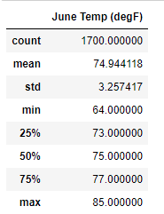
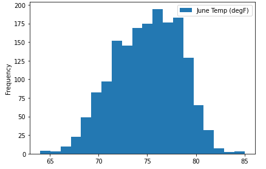
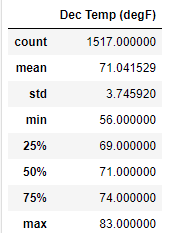
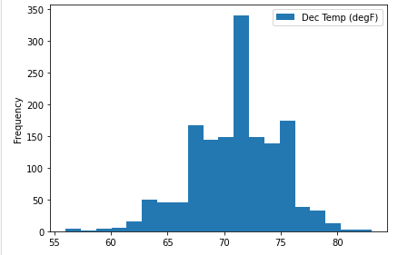
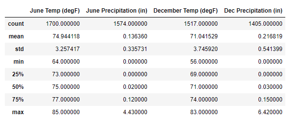
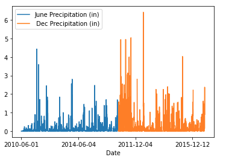

# Surf_Shop
Weather analytics project to determine favorable location for surf business

## Project Overview
This analysis will examine the weather characteristics for Oahu, Hawaii based on weather data collected from 9 different stations within the years 2010 to 2017 (raw data file “hawaii.sqlite”) provided by an investor in SQLite database format.  The relevant data is assembled and evaluated in Jupyter Notebook (*.ipynb) utilizing SLQAlchemy, NumPy and Pandas.  

The client is concerned about the weather conditions, including temperatures and amount of precipitation on Oahu.  

## Results
An early exploratory climate analysis suggested peak precipitation amounts of 3 inches or more in a day are uncommon and over the span of one year, more than 75% of the days presented less than 0.13 inches of precipitation.  A histogram of the temperature data, over the course of one year, revealed that temperatures on the island primarily (about 325 days in a year) are above 67°F. (See climate_analysis.ipynb)

The months of June and December are prime tourist months so the following sections will cover the trends in temperature for these two months between 2010 and 2017.

### June Statistics
Summary Statistics for the month of June (2010 – 2017)

### December Statistics
Summary Statistics for the month of December (2010 – 2017)

### June vs. December Observations
  - The mean temperature for the summer month of June is 74.9 degrees F which is not substantially higher than the winter month of December at 71.0 degrees F. 
  - Roughly 75% of the data for June temperatures falls above 73.0 degrees F where the minimum recorded temperature for this month is 64.0 degrees F.  December has a minimum temperature slightly lower at 56.0 degrees F, however, again roughly 75% of the temperatures in this month are going to be in the ideal temperature range of 70 degrees F or greater.
  - Both June and December months display a low standard deviation (std/mean<1) signaling a low variation among the temperature data for each month in the 8-year period.

## Summary
The statistical analysis from June and December months indicates a temperate climate in the area, ideal for outdoor sports year-round.  Based on early year-round weather analysis there were some periods of heavy precipitation, though the majority of days in a year showed low precipitation.  In order to determine whether the months of June and December exhibit frequent precipitation trends, another query was added to check precipitation amounts along with the temperature trends.

Based on precipitation analysis, the month of June displays low precipitation where more than 75% of the month sees less than 0.12 inches of precipitation.  However, there is a high degree (std/mean>1) of standard deviation between the data so there may be some variability to be expected in rain chances for June.

December trends toward higher precipitation than June both in the maximum precipitation and mean precipitation amount per day as well as a higher degree of deviation (std/mean>1) indicating the winter months and December in particular may be less favorable weather than summer months.  However, 75% of precipitation data still falls below below 0.15 inches per day and the mean precipitation is 0.22 inches indicating most days in December do not see heavy rain.

It is recommended to expand the scope of this study to include analysis on the remaining months to determine whether the business should consider opening seasonally rather than year-round.
